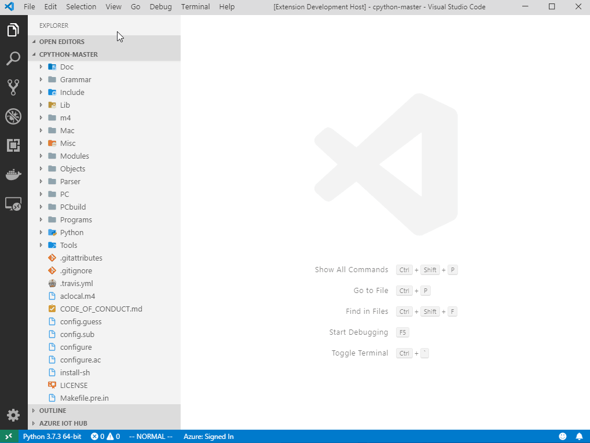

# vscode-cpython-explorer

A VS Code extension help you explore CPython internals

## Features
- Right click on the .py file to generate Python bytecode
- Jump from bytecode to C implementation

## Demo

## TODO

### Document
- CPython internals
- Extension tutorial
- Some exercises, such as add new syntax

### Extension Features
- A build button
- Explorer
    - Parser
    - AST
    - Symbol table
    - Assembler
    - PyObject
    - Interpreter
- Visualize VM
- Single step run bytecode
- Version control
